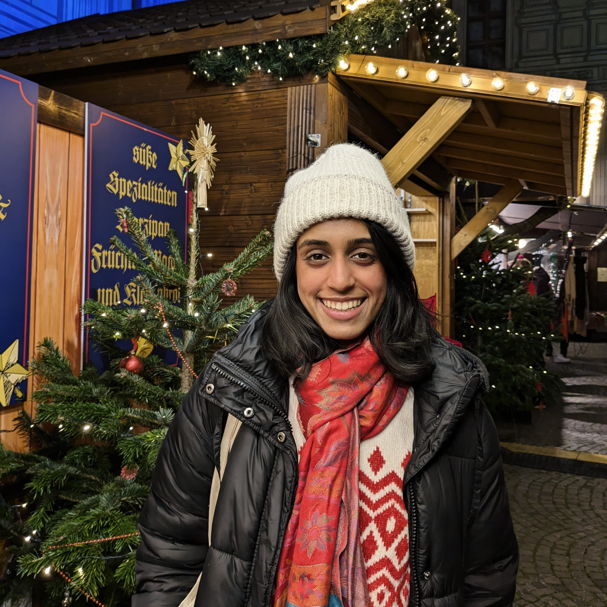

# Hi! 

  
  

    I am a Master's student specializing in **Data Engineering and Analytics** at the **Technical University of Munich**.  
    I am currently working on **leveraging LLMs to enhance personalization in tourism recommender systems**  
    at the **Chair of Connected Mobility**.  

    ### Education
    - 🎓 **M.Sc. Data Engineering and Analytics**, [Technical University of Munich], [2022-2025]  
    - 🎓 **B.Tech. Computer Science and Engineering**, [PES University], [2018-2022]  

    ### Research Interests
    - 🔍 Large Language Models  
    - ⚖ Ethics in NLP  
    - 📜 Legal NLP  

    For more details, check out my **[Publications](publications.html)**.  
    Feel free to explore my **[Publications](publications.html)** or **[Download Resume](assets/resume.pdf)**.  

    📧 You can reach out to me at: **adithi[dot]satish[at]tum[dot]de**
  

